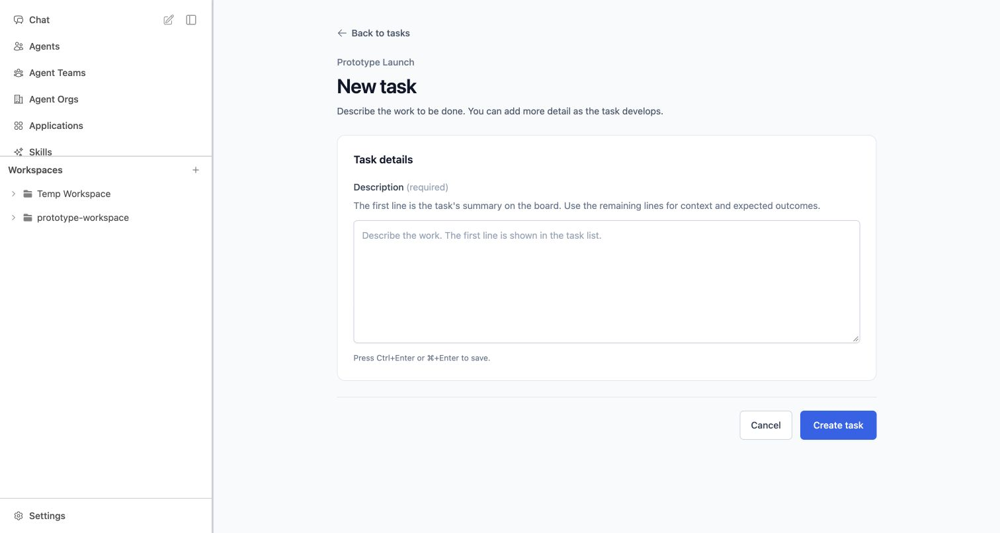

# Product review round 3 — Task pages, not popups

2026-10-02 · `PROJ-TASK-MANAGER-20261002-001` · `SR-002` Draft context.
**Awaiting User Review. Concrete layout/navigation remain a proposal, not a final UI/UX specification.**

## Review URLs / focus

- [New Task](http://127.0.0.1:3286/projects/project-prototype-launch/tasks/new)
- [Existing Task detail](http://127.0.0.1:3286/projects/project-prototype-launch/tasks/task-outline)
- [Normal Project board](http://127.0.0.1:3286/projects/project-prototype-launch)

Try New task from the board; create a multiline description; read/edit it on its own page; return to the board. The form retains one required description, not a new title field. Its first non-empty line supplies the summary. The page gives longer text room without dimming the rest of the application. This establishes a simple detail surface to evolve later, without speculative dependency, execution or result widgets.

## Change history / boundaries

| ID | Feedback / context | Candidate behavior |
| --- | --- | --- |
| PC-005 | UF-006; REQ-007/009; SCN-002/005/006, DEC-006 | New and Edit Task are regular scrolling pages inside the existing shell. Project context, one multiline description, inline required error, Cancel, Ctrl/Meta+Enter, scripted saving state. |
| PC-006 | UF-006; preserved Task identity/status | Task cards become navigable links to detail. Full description, status as a read-only badge, Task ID, Created/Updated metadata, Edit description and Back to tasks. Board search is retained per Project. |
| PC-007 | REQ-009 safeguards, DEC-009 remains open | Delete reveals an inline warning with explicit confirmation and Cancel focus first. Cancel returns focus to Delete; confirmation removes only the mock Task and returns to the board. No popup/drawer/backdrop. |

Creation opens the new Task detail with a short success notice; save returns to the same Task identity. Task and deletion success feedback clears after 3000ms, consistent with UF-005. New Tasks enter To Do; description editing does not change status. No manual status selector or drag-to-transition behavior was introduced. Existing synthetic To Do/In Progress/Done columns/cards are preserved. Project deletion and unrelated global overlays are unchanged.

AC-013 remains the canonical Draft criterion for primary Project forms, not a retroactively expanded Task criterion. UF-006 is Product-owned refinement evidence pending the user's completed review. No task-to-execution association, real status tool, manager session, assignee, priority, due date, dependency policy, result assessment or active-run cancellation behavior is implemented or approved by this round.

## Lightweight simulation

`prototype/project-review/useTaskDesignStore.ts` is a 2,721-byte handwritten fixture/state module at this round: three illustrative baseline task records, per-Project search, scripted create/edit/delete and visible-count synchronization. It does not fetch/capture/replay source responses or use real persistence/services. Descriptions and dates are illustrative. Records/edits survive client-side navigation only; full reload or dev preparation resets them. A created Task URL may not resolve in a separate freshly loaded tab because this is session-memory simulation, not durable production identity implementation.

Routes: `/projects/:id/tasks/new`, `/projects/:id/tasks/:taskId`, `/projects/:id/tasks/:taskId/edit`. Existing snapshot lookup aliases these to the accepted Project shell; native Task state remains separate. No changes to baseline capture data. Unused Task-dialog component removed; its existing localized labels reused where appropriate. New proposed instructional copy is currently English.

## Validation evidence

| Check | Result |
| --- | --- |
| Configured `corepack pnpm lint` | Pass; existing repository script/plugin/test scope, not all copied Vue components. |
| `corepack pnpm test` | 21 tests / 5 files pass, including five new native Task-state tests. |
| `corepack pnpm typecheck` | Pass; scoped prototype configuration (native modules reached through tests). Not a whole copied-frontend Vue audit. |
| `NUXT_IGNORE_LOCK=1 corepack pnpm build` | Pass with documented concurrent-dev override; existing duplicate-import warnings. |
| `git diff --check` | Pass. |
| Chrome TP-001–020 | All final checks pass; [record](review-evidence/round-3-task-page-checks.json). |

Browser checks cover normal board entry, no dialog in create/view/edit, required validation, multiline content, first-line heading, three-second success expiry, editing/Cancel, Ctrl+Enter, unchanged identity/status, read-only In Progress state, retained board search, inline delete/Cancel/confirmation, selected-only removal, missing-Task recovery, narrow creation/detail and new-Project→Task integration with visible count. Stable run console errors: none.

390×844 narrow form and detail had document width 390px and content width/scroll width 340px: no horizontal overflow. Form actions and detail/delete entry were visible/reachable. Temporary viewport override reset. One narrow-expiry locator wait returned a deadline/no-match diagnostic; fresh UI showed the successful Task, absent notice and clean URL. A Project-card count lookup was corrected to the actual visible “No workspaces” label; final count check passed. These are tool/locator limitations, not suppressed UI failures.

New route generation/dev preparation reset the previously created “hello” mock Project in the user's preview; no production data was touched. The user-facing tab was recovered via Projects→accepted baseline Project→New task rather than left on an error. The test used a separate temporary tab and was closed after evidence capture. No fresh source-parity audit, all-localization check, actual phone or soft-keyboard test, production backend or agent behavior claim.

## Non-normative visual evidence

- [Task detail — desktop](review-evidence/round-3-task-detail-desktop.jpg)
- [Inline deletion safeguard](review-evidence/round-3-task-delete-inline.jpg)
- [New Task — 390×844](review-evidence/round-3-new-task-narrow.jpg)
- [Task detail — 390×844](review-evidence/round-3-task-detail-narrow.jpg)
- [User-supplied original popup](review-evidence/user-task-popup-feedback.png)

Review screenshots only: no normative VIS references and no final `ui-ux-spec.md`.

## Provenance / lifecycle

Canonical root `/Users/normy/autobyteus_org/autobyteus-web-prototype`; active worktree `/Users/normy/autobyteus_org/autobyteus-web-prototype-worktrees/project-task-manager-foundations`; branch `prototype/project-task-manager-foundations`; accepted cumulative base `df2f5cdaf9b168298dcae79ac47c11f31dd82d7c`; preceding timer revision `e17600d`. Task-page candidate revision is the commit introducing this artifact (resolve in Git history).

Read-only source frontend `/Users/normy/autobyteus_org/autobyteus-workspace-superrepo/autobyteus-web`; retained accepted baseline pin `e9aa4a74ca36f62303bb7f5f0efd74bf89a9ea71`; Solution investigation pin remains separately `e04cfef23550c3b78286a53befc6bd5d71fb1061`.

Runtime retained at loopback port 3286, PID `80255`, session `23963`; worktree-local `.nuxt`/`.output`/dependencies. Start `corepack pnpm dev --port 3286`; reload restores fixtures. No real installation flag toggled, production/source write, canonical integration/promotion, push or cleanup. No final Product approval. **UF-004 handoff gate remains: finish direct Product review with the user before sending anything further to Solution Designer.**
