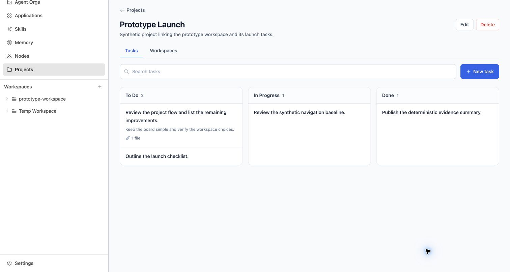
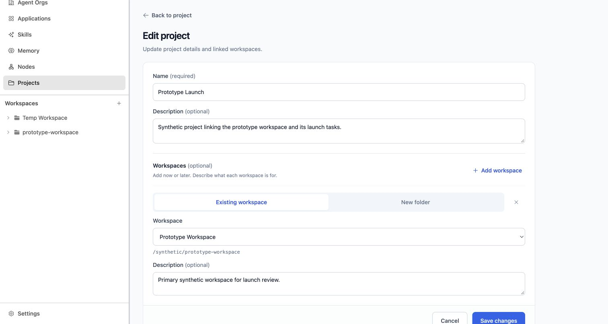
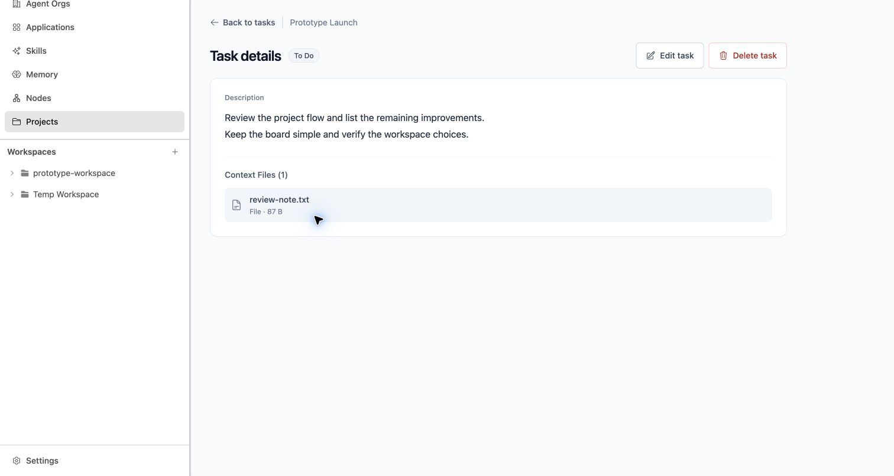

# UI/UX Specification — Projects and Tasks simplification

## Status And User Confirmation
- **Approved — represented UI and manual authoring experience only.** Canonical requirements remain Draft SR-002; this is a prototype-owned supplement, not requirements, architecture or production implementation approval.
- Package: `PROJ-TASK-MANAGER-20261002-001`; Product ticket `project-task-manager-foundations`.
- UF-017, user message on 2026-10-02: **“the ui is good now. now i confirm the ui is good. continue”**. Approval follows Round 6 (Existing/New workspace restoration), not rejected earlier alternatives.
- Related context: REQ-007/009; authoring subset of REQ-002; BEH-002/005; AC-009/012/013 UI portions; SCN-002/005/006 UI portions; DEC-006 presentation. No claim that the full criteria or scenarios have been satisfied.
- Review origin: `http://127.0.0.1:3286`; normal entry `/` → Chat → Projects → selected Project. No preview flag required.
- Final validation: 2026-10-02, FV-001–013 in [final-browser-validation.json](final-browser-validation.json).

## Repository And Baseline Provenance
- Source frontend (read-only): `/Users/normy/autobyteus_org/autobyteus-workspace-superrepo/autobyteus-web`.
- Accepted baseline source pin: `e9aa4a74ca36f62303bb7f5f0efd74bf89a9ea71`.
- Solution investigation pin: `e04cfef23550c3b78286a53befc6bd5d71fb1061`; distinct, **not newly parity-certified**.
- Canonical prototype: `/Users/normy/autobyteus_org/autobyteus-web-prototype`, integration branch `personal`.
- Ticket branch: `prototype/project-task-manager-foundations`; authoring worktree `/Users/normy/autobyteus_org/autobyteus-web-prototype-worktrees/project-task-manager-foundations`.
- Accepted prototype base: `df2f5cdaf9b168298dcae79ac47c11f31dd82d7c`.
- Exact approved runnable UI revision: `84ed47bac6877e2cdc6350cca789b0c30ffb55a3`. Finalization adds artifacts/README only; no post-approval UI change.
- Durable final folder: `tickets/done/project-task-manager-foundations/`. Package/integration receipt is in [prototype-ticket.md](prototype-ticket.md); Git commit introducing this file identifies the artifact revision without circular self-hashing.
- Applicable current-experience evidence: root `prototype-bootstrap-report.md`, accepted WEB-BASELINE-REFRESH-003 ticket and Projects WBR-R031/R032/S005/S008. This focused stage preserves that shell rather than replacing it.
- DATA-001: [provenance reassessment](review-evidence/DATA-001-assessment.md). Inherited repeated UI/Pinia snapshots originate in controlled handwritten synthetic fixtures, not a proven production-response archive. Their source-store coupling remains a lightweight implementation limitation; no correction candidate is claimed. New focused stores total 6,038 bytes and are handwritten.

## Scope And Experience Goal
- Actor: person creating/organizing a Project and its Tasks.
- Goal: use ordinary pages, direct optional workspace authoring and a simple three-column board with discoverable actions.
- Success: create a Project with zero or multiple workspace links/descriptions; add/edit later through the same form; create a Task from text/voice/context files; return to its Project's all-Tasks board; open/edit Task detail and explicitly confirm deletion.
- Preserve: existing shell/navigation and design language; Tasks/Workspaces tabs; required Task description, identity and three business statuses; explicit destructive safeguards; installed Projects default-off.
- Non-goals: Manager presentation or launch, dependencies, worker/Team discovery UI, dispatch attempts/linkage, results/completion policy, agent-write refresh, scheduler, manual drag/status mutation, shipped phone support, global modal removal or production services.

## Related Requirements And Acceptance Criteria
| Context ID | Approved UI obligation / boundary | Journey |
|---|---|---|
| REQ-007/009, AC-013 | Primary New/Edit Project are content pages, not overlays | UXJ-001/002 |
| REQ-007/009, AC-009/012 (partial) | Manual Project/Task authoring remains usable; concrete simplifications below | UXJ-001–004 |
| REQ-002, BEH-002 (partial) | Required trimmed description and initial To Do represented; persistence/tool creation not validated | UXJ-003 |
| SCN-002/005/006 (partial), DEC-006 | Three status groups; page-based Task presentation, no hidden metadata/actions | UXJ-003/004 |
| REQ-001 | No installed feature enablement; prototype synthetic enabled state is illustrative only | All |
| REQ-003–006/008/010, DEC-001–010 | Orchestration, status ownership, runtime parity and policies not decided by this approval | Out of scope |

Additional approved Product findings (UF-003/005–016) require canonical refinement: optional workspaces during creation, transient success feedback, Task pages, voice/context input, create-to-board return, continuous columns, and metadata removal. They do not silently amend SR-002.

## Production-Quality Experience And Visual Specification
### Preserved language and hierarchy
Use the accepted neutral AutoByteus shell, white navigation, slate-50 content background, restrained blue primary controls and red destructive controls. No new dashboard, decorative imagery, marketing visual system or alternate Task view. Normal Project title/description precede two tabs. Search and New task sit above three status containers. Task detail uses a modest generic heading and one description, not the whole Task sentence as a giant title.

### Layout, spacing and density
- Project detail: full available content width; horizontal inset 16px base, 24px at sm, 32px at lg; vertical inset 20px.
- Project New/Edit and Task detail: left-aligned content wrapper max-width 1040px, same 16/24/32px responsive insets. Project form is one white bordered surface, not nested workspace cards.
- Task New/Edit: centered wrapper max-width 880px; horizontal inset 16px base / 32px at sm; vertical 24px / 32px.
- Board toolbar: flex row, 12px gap; search flexes, New task fixed to content, min-height 44px.
- Board starts 24px below toolbar. Grid gap 16px. **Three equal columns when the board container is at least 752px wide**; below that, the same three groups stack in status order. No view switch or status-filter row.
- Column: one white 1px slate-200 border, radius 12px, overflow hidden. Header min-height 48px, padding 12px vertical / 16px horizontal, slate-50 at 60% opacity, bottom border slate-200.
- Task rows: padding 14px vertical / 16px horizontal, contiguous with **zero vertical gap**, no individual border, radius or shadow. Subtle 1px slate-100 dividers belong to the column's row list. Columns stretch to the tallest lane in each desktop grid row. Empty lane: centered No tasks with 28px vertical padding.
- Task summary: first non-empty line, clamp two lines; optional remaining-lines preview clamps two quieter lines, margin-top 4px. Optional paperclip/file count margin-top 8px. No assignee/dependency/priority/date widgets.
- Project form: inner padding 20px base / 24px sm; name then description 16px below. One Workspaces heading separated by slate-200 rule after 24px. Existing workspace entries and new blank draft entries are the **same repeated editable row type**, not separate display/add sections.
- Workspace entries: 16px top spacing/padding and thin slate-100 separators; one Existing workspace/New folder paired choice, one selector OR path field, one optional description, one Remove X. No count, Workspace 1 heading, summary card or Edit/Done step.
- Footer: border-top, faint slate-50 background; 20/24px horizontal and 16px vertical padding, Cancel then submit with 12px gap. Content scrolls; footer is not a floating overlay. More workspace entries may put footer below viewport.
- Task detail: Back to tasks + Project context; header margin-top/bottom 16px with status beside 24px heading, Edit then Delete on right (wrap beneath on narrow). One bordered description surface with 20/24px padding; readable width 80ch. No Task information disclosure, ID, created/updated dates.

### Typography, colors, assets
- System UI sans stack, no new font asset: `ui-sans-serif, system-ui, sans-serif, Apple Color Emoji, Segoe UI Emoji, Segoe UI Symbol, Noto Color Emoji`. Observed via computed style. Monospace only for workspace path.
- Project/Task detail headings: 24px/32px, weight 600; Project form heading tracks -0.025em. Task New/Edit heading 30px/36px, weight 600.
- Normal controls/labels/board heading and summary: 14px/20px or summary 14px/24px; weight 500, heading 600. Secondary previews/helper text: 12px/20px. Task read description: 16px/28px, weight 400.
- Narrow form inputs/textareas are 16px to avoid tiny editing text; sm+ are 14px. Long descriptions/path break or clamp as specified; no forced single-line overflow.
- Slate: 50 `#f8fafc`, 100 `#f1f5f9`, 200 `#e2e8f0`, 300 `#cbd5e1`, 400 `#94a3b8`, 500 `#64748b`, 600 `#475569`, 700 `#334155`, 800 `#1e293b`, 900 `#0f172a`.
- Blue primary 600 `#2563eb`, hover 700 `#1d4ed8`, focus 500 `#3b82f6`. Red destructive 600 `#dc2626`/700 `#b91c1c` with 50/200 warning tint/border. Success emerald-50 `#ecfdf5`, emerald-200 `#a7f3d0`, emerald-800 `#065f46`.
- Read-only status: To Do slate-100/700/200; In Progress blue-50/800/200; Done emerald-50/800/200; radius full, 12px weight 500, 10px horizontal/4px vertical padding and inset 1px ring.
- Heroicons through the inherited Iconify system: arrow-left, plus, x-mark, pencil-square, trash, paperclip, microphone/stop/spinner, document/music. Typical 16px navigation/actions, 20px input toolbar; decorative icons aria-hidden. No photo/illustration asset.
- Borders 1px; main surfaces radius 12px, inputs 8px, ordinary Task action controls 6px. Column and Task rows have no shadow. Composer subtle shadow only; Existing/New selected segment uses subtle shadow to show selection.

### Controls, feedback and motion
- Inputs min-height 44px; Add workspace and segment buttons min-height 40px; Remove 44×44px. Task mic/attachment 44×44px.
- Focus-visible ring 2px blue-500 (destructive red); form focus tint 20%. Column link focus ring is inset. Hover changes background/color only, no translating cards.
- Existing/New segments equal widths in slate-100 padded 4px bar, selected white/blue-700, inactive slate-500. `aria-pressed` conveys state. Native selector only contains eligible existing workspaces; no hidden New-folder choice.
- Busy save disables inputs and submit, displays Saving…; file add/transcription also blocks Task save. Prototype delay 250ms is illustrative, not a production latency requirement.
- Inline non-actionable Project/Task success notices use role=status and disappear at **3000ms**; remove notice marker from URL, preserve tab/other query state. Do not steal focus or auto-dismiss errors/action-required feedback. No fade required.
- Voice recording red inline status and red Stop button; spinner for starting/transcribing. Pulse/spin use motion-reduce:animate-none. Other transitions are color-only (Tailwind default 150ms easing); no layout animation.

## Journey Inventory
| ID | Starting state | Goal | Completion | Related references |
|---|---|---|---|---|
| UXJ-001 | Normal Projects index | Create Project; optionally include workspaces/descriptions | Project Tasks when zero links; Workspaces when links provided | UIS-001/002/003, VIS-001/003/018/019 |
| UXJ-002 | Project or Workspaces tab | Edit details, link/describe a workspace now or later | Updated Project, preserve origin tab | UIS-002/004, VIS-004/005/006/011 |
| UXJ-003 | Project Tasks board | Create Task via description/voice/context files | Full Project Tasks board, search cleared so new To Do row is visible | UIS-003/005, VIS-002/007/012/013/014/015 |
| UXJ-004 | Click Task row | Read/edit Task, or explicitly request deletion | Same Task after save; board after confirmed deletion | UIS-006, VIS-008/009/016/020 |

## Journey Details
1. **UXJ-001:** `/` redirects to Chat; Projects navigation → index. New project opens page with required Name, optional Description and optional Workspaces (zero rows initially). Add workspace appends a blank directly editable row and focuses its selector. Existing/New changes only row source field and preserves mode drafts/description. Remove discards that draft link, not disk content. Validate, submit, show brief success. Cancel/Back discards unsaved form edits and returns to index. No autosave, wizard or added leave-confirmation.
2. **UXJ-002:** Project Edit opens same page with existing links as directly editable rows. Workspaces Add opens Edit with one blank row appended/focused; workspace Edit focuses that row's description. Save returns to origin Workspaces tab; ordinary Project Edit returns to Tasks unless origin Workspaces. Cancel discards all drafts, including newly appended entries. Existing selected choices remain available while duplicates in other rows are excluded. New folder directly accepts a path; prototype does not create a folder on disk.
3. **UXJ-003:** Search filters descriptions across statuses, not status ownership. New task opens page with one required multiline description, Context Files strip and mic. First line is board summary; no separate title. Voice sample produces editable text, which user can review before Save. Attach via plus, drag or file paste; list shows type/size, remove/clear and optional inline image preview. Create always returns to full board in same Project, clears prior search, shows new task in To Do and 3-second success. Cancel/Back retains existing board search; no saved draft.
4. **UXJ-004:** Row link opens page with Back to tasks, Project context, read-only status and adjacent Edit/Delete. Description appears once; files section appears only if files exist. Edit opens same composer with saved context; save retains Task identity/status and returns to detail, Cancel restores saved values. Delete opens inline red confirmation with summary and irreversible-warning copy; Cancel receives focus, Escape cancels, Cancel restores Delete focus. Confirm returns to board and success feedback. No active-work cancellation/retention policy inferred.

## Screen And Surface Specification
| ID | Entry / structure | Important states | Exit | Visual IDs |
|---|---|---|---|---|
| UIS-001 Projects | `/projects`; preserved heading, description, New project, search, Project grid | Empty/populated/filter inherited | Project/New project | VIS-001 |
| UIS-002 Project editor | `/projects/new`, `/projects/:id/edit`; one form with Workspaces | Zero rows, Existing, New, blank row, invalid name/source, saving | Index/Project according to origin | VIS-003–005/011/018 |
| UIS-003 Project Tasks | `/projects/:id`; Project header/actions, tabs, Search/New task, 3 groups | Populated, empty all/one lane, filtered/no-match, brief success | New Task/Task/Workspaces/Project Edit | VIS-002/010/017/019 |
| UIS-004 Workspaces | `?tab=workspaces`; one list, name/path/description, Add/Edit/Unlink | Empty/linked/unavailable inherited | Same Project editor | VIS-006 |
| UIS-005 Task composer | `/projects/:id/tasks/new`, `/projects/:id/tasks/:taskId/edit` | Empty/valid/error, files expanded/collapsed, voice, busy | Board on create, detail on edit | VIS-007/012–016 |
| UIS-006 Task detail | `/projects/:id/tasks/:taskId`; concise heading/status/actions, description/context | Normal, inline delete confirmation, missing Task recovery | Edit/Board | VIS-008/009/020 |

## Interaction And State Transitions
| ID | Trigger | Immediate/resulting state | Side effect / next |
|---|---|---|---|
| TR-001 | New project | Normal page; heading focused | Name/description/optional workspaces |
| TR-002 | Add workspace | Append blank entry; selector focused | No save until submit |
| TR-003 | Existing/New | Field switches immediately; mode selection visible | Preserve source/path/description drafts |
| TR-004 | Remove workspace draft | Remove row; focus Add workspace | No folder deletion |
| TR-005 | Invalid Project save | Inline alert; first invalid field focused | Correct or remove row |
| TR-006 | Valid Project create/save | Saving… then destination + 3s success | Session mock only; correct tab |
| TR-007 | Workspaces Add/Edit | Same Project editor with row/focus context | Save/Cancel returns Workspaces |
| TR-008 | Search/Clear | Matching grouped tasks; no-match recovery | Per-Project search retained unless create |
| TR-009 | New Task / row click | Page, heading focused, no overlay | Author/read |
| TR-010 | Empty Task save | Describe the task. + description focus | No Task created |
| TR-011 | Voice start/stop/cancel | Starting → recording → transcribing → editable result; Cancel leaves draft unchanged | Save blocked while pending |
| TR-012 | Attach/remove/clear | Local list/preview updates; adding indicator | Save blocked briefly while adding |
| TR-013 | Valid Task create | Saving… → all Tasks board; new To Do row; Task created. for 3s | Clear old search; no dispatch |
| TR-014 | Task Edit save/Cancel | Same detail updated/unchanged | Identity/status/context retained |
| TR-015 | Delete Task | Inline warning; Cancel focused | No deletion yet |
| TR-016 | Cancel/Escape warning | Warning closes; Delete focused | Task remains |
| TR-017 | Confirm delete | Deleting… → board + Task deleted. | Prototype removal only |
| TR-018 | Notice expires | Message and notice query removed | Content/tab remain; no focus change |

## State Behavior
| State | Required presentation / recovery | Evidence |
|---|---|---|
| No workspace drafts | No workspaces linked. You can add them later.; Add optional | VIS-003 |
| Blank Project name | Enter a project name.; invalid/focus Name | VIS-018, FV-011 |
| Duplicate mock name | A project with this name already exists. Choose a different name. | Round 1 evidence; production uniqueness policy not established here |
| Missing workspace source/path | Choose a workspace, or remove this entry to continue. / Enter a folder path, or remove this entry to continue. | Round 1; native field focus implemented |
| Empty Task description | Describe the task.; focus description | VIS-013, FV-002 |
| Empty board | All three statuses with count zero and No tasks | VIS-019, FV-011 |
| No matching tasks | No matching tasks; Try another search.; Clear search | VIS-017, FV-008 |
| Task missing | Task not found; The task is no longer available in this project.; Back to tasks | TP checks Round 3 |
| Project missing in Task page | Project not found; This project is no longer available.; Back to projects | Round 3 implementation/evidence |
| Voice recording | Demo recording… Tap stop when you are done.; Cancel recording / Stop recording | VIS-014, FV-003 |
| Voice result | Sample transcription added. Review or edit the text before saving. | VIS-015, FV-003 |
| Voice no speech/error | No speech detected. Try again or type the description. / Voice input could not be transcribed. Your description is unchanged. Try again or type instead. | TI checks Round 4; optional voiceDemo scenarios only |
| File context | Context Files (N); type/size, optional inline image preview; no image overlay | VIS-015/008/016/020, TI checks |
| Delete requested | Delete task?; summary + This cannot be undone.; Cancel and Delete task | VIS-009, FV-006 |

Inherited service loading/error/retry and Project delete/unavailable-workspace states remain baseline behavior, not newly policy-approved orchestration states. Project delete remains a confirmation dialog; a global modal ban was never requested.

## Responsive And Platform Behavior
Board changes at **container** width 752px, not window width; sidebar size affects it. Narrow 390×844 references use inherited icon rail and stacked status groups; form fields/actions wrap and scroll rather than showing a popup. Desktop wrapper widths/insets above are exact. sm breakpoint is 640px, lg 1024px. Primary form footers are ordinary scroll content; narrow Task footer is reachable below the composer. Desktop native viewport changed from 1512×862 to 1512×806 during native-picker focus; every screenshot records its actual dimensions.

This is browser-width design verification, not approval/certification of phone delivery, mobile permission/keyboard behavior or OS native picker consistency. Preserve established shell responsive behavior.

## Accessibility And Keyboard Behavior
Semantic heading hierarchy, associated form labels (including repeated workspace field IDs), required/optional copy, invalid/described-by connections and inline alerts. Roving Tasks/Workspaces tabs with arrows/Home/End remain. Entry headings focused; Add/Remove and invalid-save focus explicitly routed. Task description Ctrl+Enter/Meta+Enter saves, unless pending/busy. Rows are normal keyboard-accessible links. Delete Cancel-first/Escape/restore behavior as above. Context toggle has expanded state, actions have readable labels. Do not use color as the only status signal. No comprehensive WCAG/contrast audit or actual phone assistive-technology validation claimed.

## Content, Labels, Validation, And Feedback
UI-controlled copy and ordering in final references/code are normative, except explicit prototype simulation labels below. Project headings New project/Edit project; Name (required), Description (optional), Workspaces (optional), Existing workspace/New folder, Workspace/Folder path, Add workspace, Cancel/Create project/Save changes. Task headings New task/Edit task/Task details; Description (required), Context Files, Attach files, Start voice input/Stop recording, Cancel/Create task/Save changes, Edit task/Delete task. Status labels To Do/In Progress/Done are unchanged. No List view, extra workspace totals or Task-information section. Field values trim at save; Project Name maxlength 200 in prototype. Task file-only save is not supported without description; a future change requires a separate decision.

## Data, Contract, And Mock Boundaries
| Boundary | Prototype | Production obligation / unknown |
|---|---|---|
| Projects/Tasks | Handwritten Pinia records, scripted memory-only saves; reload resets edits | Durable identity, persistence, node scoping and real error contracts must be specified separately |
| Workspace source | Two fake existing choices; New path produces illustrative link only | Meaning/validation of path, registration vs actual folder creation, availability/permission checks not authorized by the label |
| Voice | Handwritten sample; no microphone/transcription service | Preserve editable-before-save interaction; consent, capture, availability/privacy/transcription errors need canonical decisions |
| Files | Metadata, type/size and browser object URL for images; no upload or retention | Storage/security/limits/agent access/deletion and raw-audio handling unresolved |
| Status | Read-only fixture TODO/IN_PROGRESS/DONE; create TODO | Ownership/transitions/completion evidence not decided; no status tool claim |
| Execution/Manager | No linkage or orchestration in candidate | Discovery, independent parallel delegation, dependencies, outcomes and agent-write refresh await refinement/design |
| Project deletion | Existing confirmation; prototype retains inherited open-task-count warning logic | All-Task count when Done exists and active-work deletion semantics remain DEC-009; do not copy known incomplete count into production |
| Feature flag | Only prototype synthetic enabled state | Installation unchanged; experimental default-off continues |

Demo copy (“Voice uses a sample transcript…”, “Demo recording…”, “Sample transcription added…”) communicates prototype boundaries; production may substitute truthful real-operation copy after the underlying behavior is approved. Do not ship claims of a sample/no-mic service for a real capture path.

## Final Visual Reference Inventory
All VIS IDs are **scoped to this ticket**. Actual screenshots captured after UF-017 and final validation. Every visible detail is defining unless excepted: fixture Project/task/workspace names, prose, paths, IDs, numeric counts, dates, file names/type/size/sample transcript content are illustrative; their typography, layout, treatment and state-driven presence are defining. Cursor/highlight artifacts, OS/browser chrome, navigation scroll offset and locale-specific native picker rendering are not product requirements. Different numbers of rows may change height/scroll naturally; no alternative List/card-gap design is permitted.

| Visual ID | Surface/state | Actual viewport | Screenshot | Defining details |
|---|---|---|---|---|
| VIS-001 | Projects index | 1512×862 | [screenshot](visual-references/VIS-001-projects-index-desktop-1512x862.jpg) | Structure, density, controls, tokens, UI copy/state; domain values illustrative |
| VIS-002 | Continuous populated board | 1512×806 | [screenshot](visual-references/VIS-002-continuous-board-desktop-1512x806.jpg) | Structure, density, controls, tokens, UI copy/state; domain values illustrative |
| VIS-003 | New Project, zero workspace entries | 1512×806 | [screenshot](visual-references/VIS-003-new-project-desktop-1512x806.jpg) | Structure, density, controls, tokens, UI copy/state; domain values illustrative |
| VIS-004 | Edit Project, Existing workspace | 1512×806 | [screenshot](visual-references/VIS-004-edit-project-existing-desktop-1512x806.jpg) | Structure, density, controls, tokens, UI copy/state; domain values illustrative |
| VIS-005 | Edit Project, New folder | 1512×806 | [screenshot](visual-references/VIS-005-edit-project-new-folder-desktop-1512x806.jpg) | Structure, density, controls, tokens, UI copy/state; domain values illustrative |
| VIS-006 | Project Workspaces tab | 1512×806 | [screenshot](visual-references/VIS-006-project-workspaces-desktop-1512x806.jpg) | Structure, density, controls, tokens, UI copy/state; domain values illustrative |
| VIS-007 | New Task empty composer | 1512×862 | [screenshot](visual-references/VIS-007-new-task-desktop-1512x862.jpg) | Structure, density, controls, tokens, UI copy/state; domain values illustrative |
| VIS-008 | Task detail with saved context | 1512×806 | [screenshot](visual-references/VIS-008-task-detail-desktop-1512x806.jpg) | Structure, density, controls, tokens, UI copy/state; domain values illustrative |
| VIS-009 | Inline Task delete confirmation | 1512×806 | [screenshot](visual-references/VIS-009-task-delete-confirmation-desktop-1512x806.jpg) | Structure, density, controls, tokens, UI copy/state; domain values illustrative |
| VIS-010 | Narrow stacked board | 390×844 | [screenshot](visual-references/VIS-010-continuous-board-narrow-390x844.jpg) | Structure, density, controls, tokens, UI copy/state; domain values illustrative |
| VIS-011 | Narrow Project form, multiple links | 390×844 | [screenshot](visual-references/VIS-011-project-form-narrow-390x844.jpg) | Structure, density, controls, tokens, UI copy/state; domain values illustrative |
| VIS-012 | Narrow Task composer | 390×844 | [screenshot](visual-references/VIS-012-task-composer-narrow-390x844.jpg) | Structure, density, controls, tokens, UI copy/state; domain values illustrative |
| VIS-013 | Task required-description error | 1512×862 | [screenshot](visual-references/VIS-013-task-validation-desktop-1512x862.jpg) | Structure, density, controls, tokens, UI copy/state; domain values illustrative |
| VIS-014 | Voice recording while field error remains | 1512×862 | [screenshot](visual-references/VIS-014-task-voice-recording-desktop-1512x862.jpg) | Structure, density, controls, tokens, UI copy/state; domain values illustrative |
| VIS-015 | Editable transcript + context file | 1512×806 | [screenshot](visual-references/VIS-015-task-context-files-desktop-1512x806.jpg) | Structure, density, controls, tokens, UI copy/state; domain values illustrative |
| VIS-016 | Edit Task composer with context | 1512×806 | [screenshot](visual-references/VIS-016-edit-task-desktop-1512x806.jpg) | Structure, density, controls, tokens, UI copy/state; domain values illustrative |
| VIS-017 | Board search no-match | 1512×806 | [screenshot](visual-references/VIS-017-board-no-match-desktop-1512x806.jpg) | Structure, density, controls, tokens, UI copy/state; domain values illustrative |
| VIS-018 | Project required-name error | 1512×806 | [screenshot](visual-references/VIS-018-project-validation-desktop-1512x806.jpg) | Structure, density, controls, tokens, UI copy/state; domain values illustrative |
| VIS-019 | Three empty board groups | 1512×806 | [screenshot](visual-references/VIS-019-empty-board-desktop-1512x806.jpg) | Structure, density, controls, tokens, UI copy/state; domain values illustrative |
| VIS-020 | Narrow adjacent Task actions | 390×844 | [screenshot](visual-references/VIS-020-task-actions-narrow-390x844.jpg) | Structure, density, controls, tokens, UI copy/state; domain values illustrative |

Key references:

## Linked Prototype Evidence
- [Ticket/lifecycle](prototype-ticket.md), [runbook](prototype-runbook.md), [behavior matrix](ui-behavior-test-matrix.md), [change log](prototype-change-log.md), [handoff findings](handoff-notes.md).
- [Feedback history](ui-brainstorm-record.md); review-round-1/3/4/5/6.md and review-evidence preserve historical validation/alternatives. Their screenshots **are not normative**, and superseded List, separated-card, Workspace Edit/Done and Task-information states must not be implemented.
- Final FV evidence plus prior RV-001–023, timer checks, TP-001–020, TI-001–020, FS-001–009, WC-001–006 cover affected journeys; they do not prove production APIs.

## Implementation Fidelity Boundary
Implement exact approved page/column hierarchy, labels, spacing/tokens, adjacent actions, Existing/New direct choice, navigation/return/focus, transient feedback and represented validation/recovery. Reuse target product design-system controls without altering the defined appearance/behavior. Local stores, fake IDs/dates, 250/300/800ms scripted waits, synthetic snapshot hydrator and fake file URLs do **not** prescribe backend architecture or latency. Domain values vary; truthful production simulation-copy replacement is permitted. Normal entry points must expose approved UI, not a preview-only flag.

## Out Of Scope
No implementation in source repository; no live integrations, durability, concurrent execution or performance/security claim. No additional manager widgets/badges/status columns, global modal removal, phone release, auto-save or manual status drag. Prototype completion cannot settle all SR-002 requirements.

## Open Decisions And Risks
See [handoff-notes.md](handoff-notes.md). DEC-006 authoring/board/detail presentation is resolved for this slice; waiting/blocked/failed/review/result information remains open. DEC-007 Manager presentation/launch/context is not settled. DEC-001–005/008–010 remain open. Source pins differ, voice/files need real contracts, Project deletion count and node-rebinding for new mock records are not production-tested. UF-015 alternate labels were not implemented; approved Round 6 is authoritative, not that suggestion.

## Final Consistency Check
- Explicit user UI confirmation: Yes (UF-017); full requirements approval: No.
- Source pin, accepted base, exact UI revision, repository/ticket/branch: recorded.
- Normal/default entry, affected desktop/narrow journeys: validated; final refs match current code. No post-approval UI change.
- Unit/configured lint/scoped TS/full build results: in matrix; not a comprehensive source-feature lint/type audit.
- Mock boundaries, unresolved policies and illustrative content: explicit.
- Finalization/integration/cleanup receipt: prototype-ticket.md; do not infer terminal completion from this file alone.
