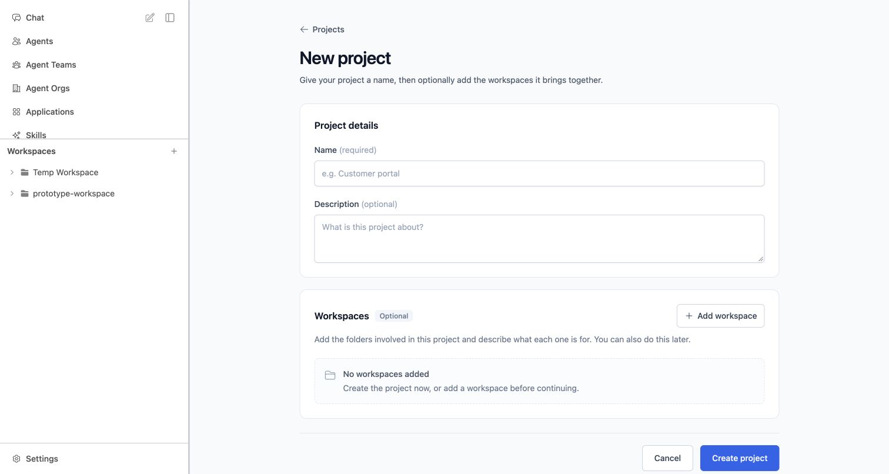

# Product review round 1 — Project authoring

2026-10-02 · `PROJ-TASK-MANAGER-20261002-001` · received requirements `SR-002` Draft.
**Awaiting User Review; not an approved specification or completed Product stage.**

## Review

- [New Project](http://127.0.0.1:3286/projects/new): normal content page, not an overlay.
- [Edit Project](http://127.0.0.1:3286/projects/project-prototype-launch/edit): same page pattern, prefilled details and links.
- [Projects](http://127.0.0.1:3286/projects): normal entry actions lead to these pages.
- Try creating with only a name; then try Add workspace, its description, and multiple entries. Workspaces are optional and can be added later through the same editor.

## Candidate delta / traceability

| Change | User feedback / draft context | Review behavior |
| --- | --- | --- |
| PC-001 | UF-001/002; REQ-007/009, AC-013; SCN-002/005/006, DEC-006/007 | New/Edit become scrolling pages inside the existing shell. Inline name errors; Cancel/Back discard drafts and return to origin. Cancel preserves list search. |
| PC-002 | UF-003; workspace-authoring refinement pending | Optional workspace section on New and Edit. Add/remove draft entries, choose an existing fixture workspace or enter a folder path, give each an optional description. Zero entries allowed. Incomplete rows require completion or removal. |
| PC-003 | REQ-009; existing Projects context | Save returns to Project detail with feedback. New projects with links open Workspaces so descriptions can be checked; zero-link projects open an empty Tasks board. Edit retains the originating Workspaces tab. Existing board remains intact. |

Concrete routing, page composition and save destinations are proposals for user review, not approved alternatives. No Manager, dependencies, execution attempts or result assessment UI was added. Task dialogs and deletion confirmation remain outside this slice; no global modal-removal or active-work policy is inferred.

## State and run boundary

The small handwritten module `prototype/project-review/useProjectDesignStore.ts` holds illustrative Projects and workspace choices. Saves are scripted in browser memory, with a brief saving state. Reload/dev preparation clears candidate edits. A folder path does not create/register a directory, inspect files or write to the installed application. No production API, credentials, backend, agent delegation or persistent storage is used.

Start from the active worktree with `corepack pnpm dev --port 3286`. Worktree-local `node_modules`, `.nuxt` and `.output` are isolated. Runtime PID at capture: `80255`, session `23963`, loopback port 3286. Reload restores fixtures; use the existing prototype scenario control for baseline scenarios. Default populated English was the review scenario.

## Validation

| Check | Result |
| --- | --- |
| `corepack pnpm lint` | Pass; repository-configured script/plugin/test scope, not all copied Vue components. |
| `corepack pnpm test` | 16 tests / 4 files passed, including four native Project-state tests. |
| `corepack pnpm typecheck` | Pass; repository's scoped prototype TypeScript check. |
| `corepack pnpm build` | First attempt refused the active dev lock. Documented concurrent-dev rerun `NUXT_IGNORE_LOCK=1 corepack pnpm build` completed successfully. |
| `git diff --check` | Pass. |
| Browser RV-001–023 | All passed; details in [record](review-evidence/round-1-browser-checks.json). |

Chrome checked required/duplicate-name errors, zero-workspace creation, multiple links with independent descriptions, incomplete-row recovery, selection deduplication, saved edit, Cancel, add later, draft removal, reload/not-found recovery, normal entry points and preserved populated board. At 390×844 the form scrolls in one column, actions are reachable and no horizontal overflow was measured. The final stable desktop navigation emitted no browser console errors. Temporary viewport override was reset.

Limitations: not a fresh source-parity audit, not every inherited route/state/localization, not an actual phone or soft-keyboard test, not production functionality. Build/dev restart reset mock-created records during validation; edit/save was rerun successfully on fresh records. This is expected memory-only state, not durable Tasks implementation.

## Non-normative visual evidence

- [Edit Project — desktop](review-evidence/round-1-edit-project-desktop.jpg)
- [Narrow New Project — initial form](review-evidence/round-1-new-project-phone-empty.jpg)
- [Narrow New Project — workspace row and actions](review-evidence/round-1-new-project-phone-workspace.jpg)

Screenshots are user-review evidence only; no final `VIS-*` references or `ui-ux-spec.md` exist yet.

## Provenance and review gate

Canonical prototype root `/Users/normy/autobyteus_org/autobyteus-web-prototype`; active worktree `/Users/normy/autobyteus_org/autobyteus-web-prototype-worktrees/project-task-manager-foundations`; branch `prototype/project-task-manager-foundations`; accepted cumulative base `df2f5cdaf9b168298dcae79ac47c11f31dd82d7c`. Candidate revision is the commit introducing this artifact (resolve through Git history).

Source frontend `/Users/normy/autobyteus_org/autobyteus-workspace-superrepo/autobyteus-web`; retained accepted baseline source pin `e9aa4a74ca36f62303bb7f5f0efd74bf89a9ea71`. Solution investigation pin `e04cfef23550c3b78286a53befc6bd5d71fb1061` is separate, not silently substituted. DATA-001 [provenance assessment](review-evidence/DATA-001-assessment.md) found repeated synthetic UI state, not evidence of production records in inspected inputs. Broad baseline cleanup remains held; no corrected baseline claimed.

The candidate is committed only on the Product ticket branch. No canonical integration/promotion, remote push or production edit. Projects remains experimental/default-off in the real product; no installed setting changed. Per UF-004, accumulate Product findings here and continue directly with the user; **no further Solution Designer handoff until Product design is finished and the user confirms**.
